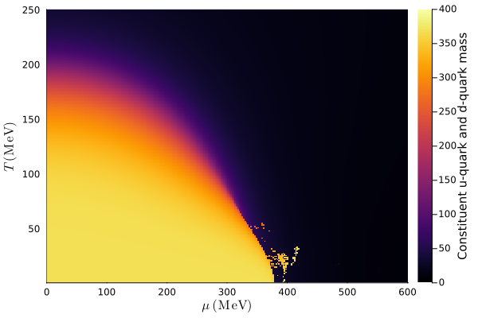
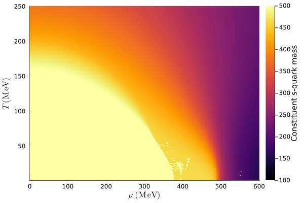

# Three Flavor NJL Model Solver

This repository contains a C implementation for solving the phase diagram of the three-flavor Nambu–Jona-Lasinio (NJL) model. The main function `double solv_gap_eq_multi_guess_solver_restrict(double T, double mu[3], double(* M)[3])` is used to calculate the phase diagram of the three-flavor NJL model.




## Prerequisites

To compile and run the code, you need the following libraries:

- GNU Scientific Library (GSL)
- Standard C libraries (`stdio`, `math`, `string.h`)

## Compilation

To compile the code, use the following command:

```sh
gcc -o njl_solver three_flavor_njl.c -lgsl -lgslcblas -lm
```

## Usage

The main function to use is `solv_gap_eq_multi_guess_solver_restrict`. This function solves the gap equations using a nonlinear solver and returns the constituent quark masses.

### Function Signature

```c
double solv_gap_eq_multi_guess_solver_restrict(double T, double mu[3], double(* M)[3]);
```

### Parameters

- `T`: Temperature in MeV.
- `mu`: Array of chemical potentials for the three flavors (u, d, s).
- `M`: Pointer to an array where the calculated constituent quark masses will be stored.

### Example

```c
#include <stdio.h>
#include "three_flavor_njl.h"

int main() {
    double T = 150.0;
    double mu[3] = {300.0, 300.0, 300.0};
    double M[3];

    if (solv_gap_eq_multi_guess_solver_restrict(T, mu, &M) == GSL_SUCCESS) {
        printf("Constituent quark masses: M_u = %f, M_d = %f, M_s = %f\n", M[0], M[1], M[2]);
    } else {
        printf("Solver failed to converge.\n");
    }

    return 0;
}
```

## Functions

### `double np_f(double p, double T, double mu, double M)`

Computes the Fermi-Dirac distribution function for particles.

### `double np_f_bar(double p, double T, double mu, double M)`

Computes the Fermi-Dirac distribution function for antiparticles.

### `double OmegaMf(double T, double mu_f, double Mf)`

Computes the free thermodynamic potential (grand potential) for a Fermi gas.

### `double Omega_temp(double T, double mu[3], double phi[3])`

Computes the total thermodynamic potential including interaction terms.

### `double phi_f(double T, double mu_f, double Mf)`

Computes the derivative of Omega_temp with respect to mass M.

### `int gap_eqs(const gsl_vector* v, void* params, gsl_vector* f)`

Defines the nonlinear system of equations for the gap equations.

### `double solv_gap_eq(double T, double mu[3], double(* M)[3])`

Solves the gap equations using a nonlinear solver.

### `int phi_eqs(const gsl_vector* v, void* params, gsl_vector* f)`

Defines the nonlinear system of equations for the phi equations.

### `double solv_phi_eq(double T, double mu[3], double(* phi)[3])`

Solves the phi equations using a nonlinear solver.

### `double Omega(double T, double mu[3])`

Computes the thermodynamic potential Omega at a given temperature and chemical potentials.

### `double pressure(double T, double mu[3])`

Computes the pressure at a given temperature and chemical potentials.

### `int calc_M(double phi_sol[3], double(* M_sol)[3])`

Calculates the constituent quark masses given the solution for the chiral condensates.

### `int M_phi_eqs(const gsl_vector* v, void* params, gsl_vector* f)`

Defines the nonlinear system of equations for the phi equations given the constituent quark masses.

### `int calc_phi(double M_sol[3], double(* phi_sol)[3])`

Calculates the quark condensates given the solution for the constituent quark masses.

### `double solv_gap_eq_multi_guess(double T, double mu[3], double(* M)[3])`

Solves the gap equations using a nonlinear solver with multiple initial guesses.

### `int calc_phi_multi_guess(double T, double mu[3], double M_sol[3], double(* phi_sol)[3])`

Calculates the quark condensates given the solution for the constituent quark masses using multiple initial guesses.

### `double solv_gap_eq_multi_guess_solver(double T, double mu[3], double(* M)[3])`

Solves the gap equations using a nonlinear solver with multiple initial guesses.

### `double solv_gap_eq_multi_guess_solver_restrict(double T, double mu[3], double(* M)[3])`

Solves the gap equations using a nonlinear solver with multiple initial guesses and additional restrictions.

## License

This project is licensed under the MIT License - see the [LICENSE](LICENSE) file for details.

## Acknowledgements

This code relies on the GNU Scientific Library (GSL) for numerical computations. Special thanks to the developers of GSL for providing such a robust library.
```` ▋
